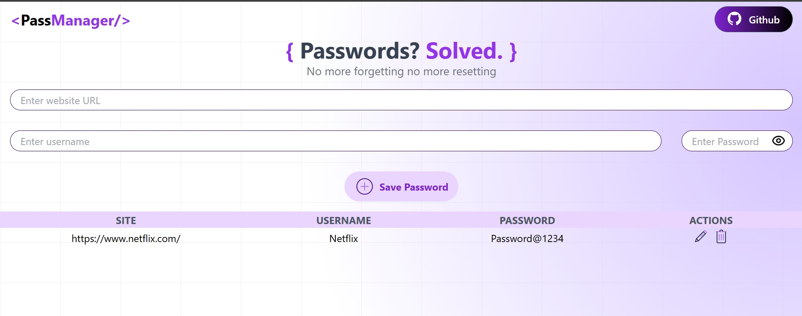

# 🔐 PassManager

*No Forgetting, No Resetting*

PassManager is a secure and minimal password manager built using the MERN stack – **MongoDB, Express, React, and Node.js** – with **Tailwind CSS** for modern styling. Save and manage your passwords with ease, locally and securely.

🌐 **Live Demo**: [Click here to try it out](https://passmanager-frontend-5cs4.onrender.com)

---

## ✨ Features

- 🔐 Save your passwords securely
- ⚡ Fast and responsive UI with React + Tailwind
- 💾 MongoDB-backed data persistence
- 🛠 Built with Express and Node.js for backend
- 📱 Mobile responsive & user-friendly

---

## 🖼️ Screenshots

> Replace these with actual screenshots (You can add the image files in your repo and use the relative path like `./screenshots/home.png`)

### 🔓 UI of PassManager


---

## 🛠️ Tech Stack

- **Frontend:** React, Tailwind CSS
- **Backend:** Node.js, Express
- **Database:** MongoDB

---

## 🚀 How to Run Locally

```bash
# Clone the repository
git clone https://github.com/your-username/passmanager.git
cd passmanager

# Install dependencies for client and server
cd client
npm install
cd ../server
npm install

# Start the server
npm run start

# In a new terminal, start the client
cd ../client
npm run dev
